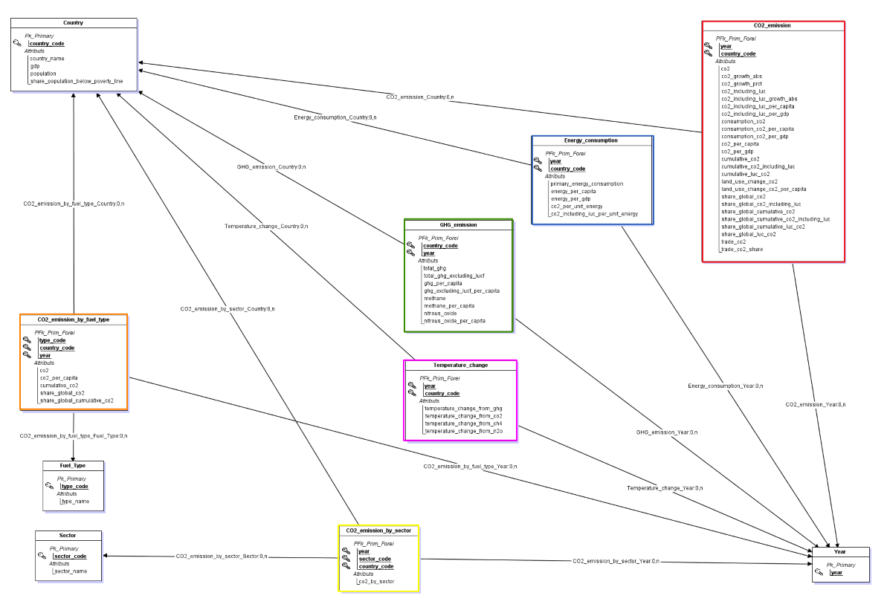
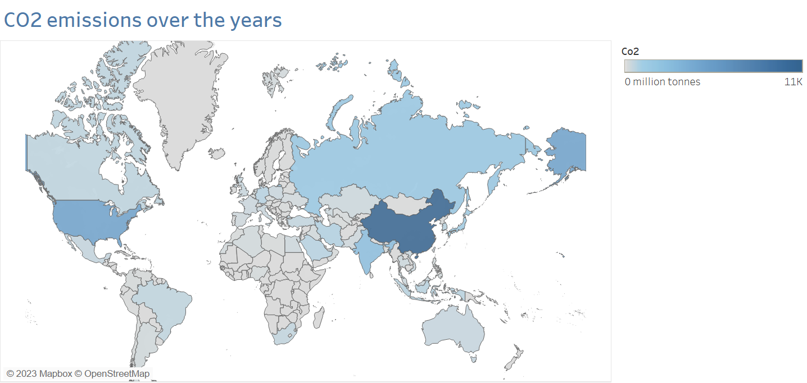
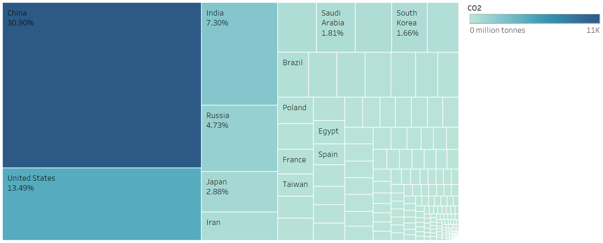
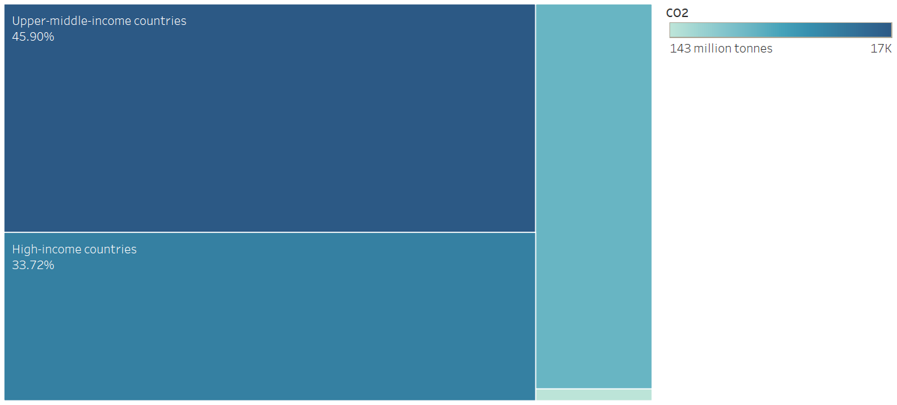
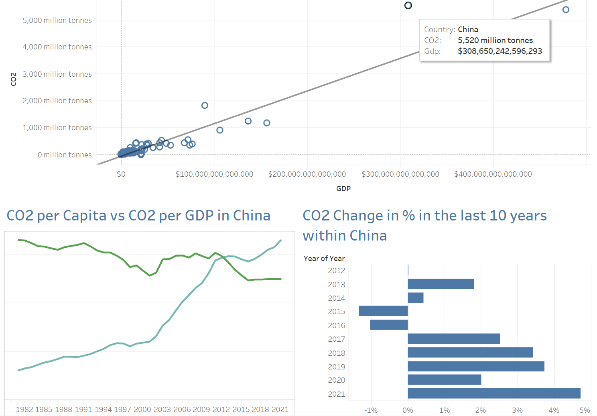
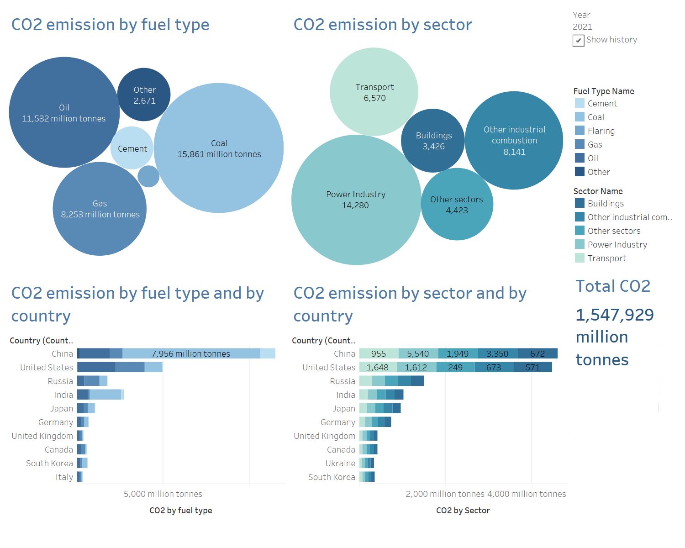
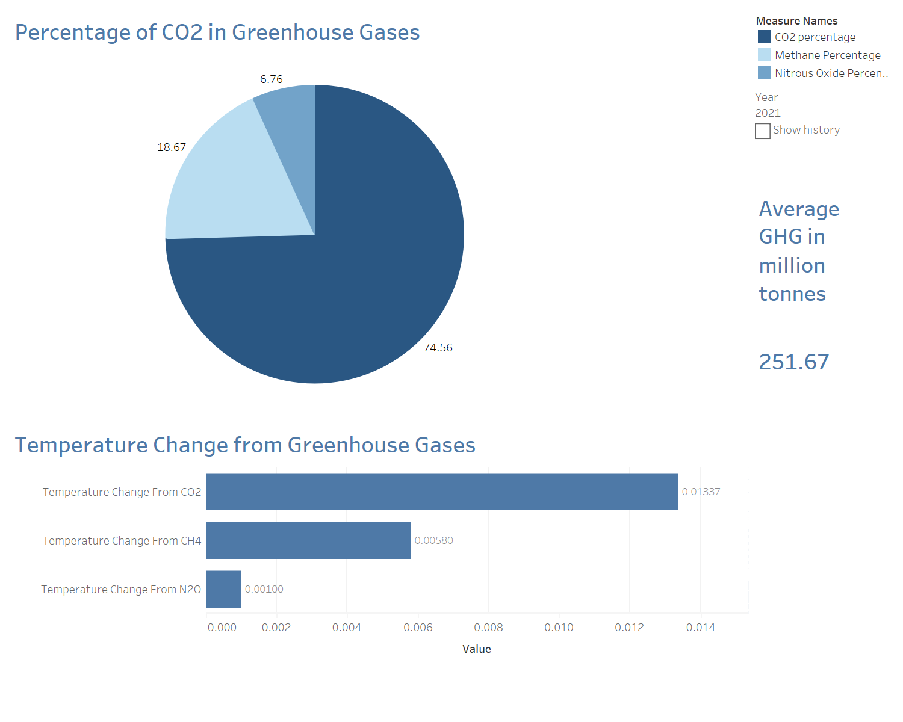

# Reduce CO2 Emissions

## Introduction
The delicate balance of greenhouse gases has played a crucial role in maintaining a livable climate for humans and the diverse array of species that inhabit our planet. However, this equilibrium has been disrupted, posing a significant threat to the survival and distribution of life on Earth. The concentration of carbon dioxide, the most abundant and dangerous greenhouse gas, has reached unprecedented levels in our atmosphere. This alarming increase is primarily attributed to human activities, particularly the burning of fossil fuels. As these gases are released into the air, they absorb solar energy and trap heat near the Earth’s surface, a phenomenon known as the greenhouse effect. This heightened greenhouse effect has far-reaching implications. It hinders the natural dissipation of heat into space, leading to rising temperatures and climate disruptions. These changes in our climate system have the potential to reshape the distribution of habitats and alter the conditions necessary for various organisms to thrive. By recognizing the urgency of this situation, we can strive to restore the delicate balance of greenhouse gases and mitigate the impacts of climate change. Implementing sustainable practices, transitioning
to renewable energy sources, improving energy efficiency, and adopting environmentally conscious lifestyles are all crucial steps in reducing greenhouse gas emissions and especially the CO2 emission,
to ensure a healthier, more resilient environment for generations to come. I decided to undertake a project on CO2 emissions due to my deep love and concern for the environment. As an eco-friendly
individual, I am passionate about preserving the natural world and its precious resources. My affection for animals further motivates me to take action against climate change and reduce my carbon footprint. I actively strive to make sustainable choices in my daily life, such as recycling waste, limiting the amount of water I am using and minimizing air travel whenever possible by taking the train, as I
understand the significant impact it has on CO2 emissions. By delving into the topic of CO2 emissions, I aim to gain a deeper understanding of the issue and contribute to finding effective solutions that can
mitigate the environmental challenges we face.

## Data Modeling and Preparation
###  Conceptual Entity-Relationship and Logical Snowflake schema
After constructing the ER schema using JMerise, the logical snowflake schema was derived from the conversion of the MCD file, as illustrated in this figure. More details in the report.

### Data Preparation
Upon examining the three datasets, I determined the time periods covered by each of them. The first dataset, ”CO2 and Greenhouse Gas Emissions,” spans from 1750 to 2021, providing a comprehensive historical perspective. The second dataset, ”Extreme Poverty,” covers the years from 1981 to 2021,
offering a more recent focus on poverty-related data. Lastly, the dataset titled ”CO2 emissions of all world countries” encompasses the years from 1970 to 2021, providing a broader range of information
on CO2 emissions. To ensure a meaningful intersection among the datasets and minimize the presence of missing values, I made the decision to retain only the observations from 1981 to 2021. This
narrower time frame allows for a consistent and aligned analysis across the datasets, enabling effective comparison and exploration of the data. With the data aligned in terms of time period, I proceeded
to analyze each dataset individually. Extensive details about each source of data are mentioned in the report, The full code is in Data Preparation Code file.

## Analysis
In Tableau, I did a story where I show all my plots and dashboards, I just included here the most relevant ones and the rest of the plots are in my tableau file "Tableau.twb" in the story section: Reduce CO2 emission.

### Insights
The visual representation in the figure below illustrates the global distribution of average CO2 emissions on a world map, specifically focusing on data from the year 2000 onward. This chart is showing the increase of carbon dioxide emissions over the world as the blue color is getting darker and darker over the years in most of the countries (clear in the Tableau file while running the video). The map highlights the significant role played by a country's level of development in contributing to CO2 emissions. Developed countries, such as China, tend to have the highest levels of CO2 emissions and have consistently ranked at the top for the past two decades. India is also a major contributor to CO2 emissions and faces significant challenges in addressing this issue. Russia is also playing an important role in the increase of CO2 emission in the last 10 years. 

In the figure below, the most problematic countries occupy the most significant area. Each country is represented by blocks of varying colors and sizes, arranged in order of severity from the top-left corner to the bottom-left corner. From 1981 till 2005, the United states were leading, but China was growing step by step. After 2006, China stands out as the leading contributor to global CO2 emissions, followed by the United States in second place, followed by India in third place. The percentage next to each country represent its global share of CO2. China, United States, India, Russia and Japan account for more than 50\% of the whole CO2 emission over the world. This plot also proves the increase of CO2 emission over the world from 1981 till 2021 since the big square is getting bigger and bigger (clear in the Tableau file while running the video).

Taking a different perspective, it's interesting to observe that the countries with the highest CO2 emissions (over all the years from 1981 till 2021) are predominantly the developed nations, which coincidentally have higher income levels, as shown in the figure below. This correlation suggests a strong link between economic prosperity and carbon emissions.

The first graph in the figure below showcases a strong positive correlation between economic growth and CO2 emissions. As the GDP of a country is higher, so does its CO2 emissions. When hovering over a scatter dot, we can observe the average CO2 emissions per capita and CO2 emissions per gdp over the years for that specific country. For instance, China has experienced a significant surge in CO2 emissions per capita over the past decade, while we see in the Covid period a decrease in CO2 per GDP, probably because industries and transportation means were closed. Additionally, the graph highlights the percentage change in CO2 emissions over the last 10 years. China's percentage change reveals a constant increase. 

Let us examine both the fuel type and sector dimensions over the years. As we embark on this exploration, shown in the figure below a clear narrative begins to emerge. Coal stands out prominently as the dominant fuel type, consistently maintaining its leading position throughout the years. Similarly, the Power Industry emerges as the prominent sector, demonstrating a sustained influence on CO2 emissions over time. When we shift our focus to the countries contributing to CO2 emissions, a striking revelation awaits us. China, a powerhouse in both production and population, emerges as the primary behind coal-related emissions. With a staggering total of 7,956 million tons emitted by coal, China's significant contribution accounts for nearly half of the global coal-related CO2 emissions. In comparison, the rest of the world combined amounts to 15,861 million tons—a noteworthy disparity. Furthermore, an intriguing correlation emerges as we analyze the top-ranking countries in terms of both fuel type and sector. The top five countries leading in CO2 emissions align remarkably across both dimensions. This convergence underscores the critical role these nations play in the global CO2 landscape, emphasizing their responsibility and potential impact in mitigating CO2 emissions. These findings highlight the imperative for concerted efforts from these top-ranking countries to address and reduce CO2 emissions. With their substantial contributions to both the fuel type and sector emissions, these nations hold significant potential for implementing effective strategies and initiatives aimed at curbing CO2 output.

CO2 plays a central role in driving global climate change, but it's important to recognize that it is not the sole greenhouse gas responsible for this phenomenon. Other greenhouse gases, such as methane (CH4) and nitrous oxide (N2O), also contribute significantly to global warming. Understanding the relative contributions of these gases is essential in addressing climate change effectively. By analyzing the percentage of CO2 emissions compared to other greenhouse gases, we can gain valuable insights. Over the years, the percentage of CO2 emissions has been steadily increasing. In 1981, CO2 accounted for 60.4\% of total greenhouse gas emissions, and by 2021, this figure rose to 74.56\% as shown  in the figure below. In addition to the increasing percentage of CO2 emissions compared to other greenhouse gases, it is noteworthy that the overall quantity of greenhouse gas (GHG) emissions is also on the rise.  This means that not only is the proportion of CO2 emissions rising, but the overall quantity of GHG emissions is also growing. This upward trend underscores the urgent need to reduce CO2 emissions as a crucial step in mitigating the impact of greenhouse gases on our climate. In the second graph, we observe the temperature effects generated by different greenhouse gases. It is evident that CO2 contributes to higher temperature changes compared to CH4 and N2O. This finding highlights the significant role of CO2 as the most potent greenhouse gas driving climate change. It underscores the imperative for immediate action to curb CO2 emissions and address the primary driver of global warming.

### Recommendations
#### Government and Policy Makers

- **Transition to Renewable Energy:** Implement policies that encourage the deployment of renewable energy infrastructure such as solar, wind, hydro, and geothermal power to reduce CO2 emissions from the Power Industry sector and fuel types such as Coal.

- **Carbon Pricing and Emissions Trading:** Introduce carbon taxes that provide economic incentives for businesses to reduce their CO2 emissions and invest in cleaner technologies.

- **Sustainable Transportation:** Promote the use of public transportation to reduce emissions from the Transportation sector by creating special discounts (e.g., carte avantage) + Invest in the development of charging infrastructure for electric vehicles and encourage the adoption of fuel-efficient and low-emission vehicles.

- **Sustainable Urban Planning:** Establish green building practices and energy-efficient construction standards and regulations to reduce emissions from the Building sector.

#### International Organizations and NGOs

- **Public Awareness and Education:** Launch public awareness campaigns to educate the public about the importance of reducing CO2 emissions and the individual actions they can take + Foster a culture of sustainability and environmental responsibility through education and community engagement.

- **International Cooperation:** Collaborate with other countries and actively participate in international agreements and initiatives aimed at reducing CO2 emissions, such as the Paris Agreement.

- **Monitoring and Reporting:** Support the establishment of robust monitoring, reporting, and verification systems to track progress in reducing CO2 emissions.

- **Research and Innovation:** Support research and innovation in clean energy technologies, sustainable practices, and climate solutions by funding these projects.

#### Industries and Head of Factories

- **Energy Efficiency Improvements:** Conduct energy audits, upgrade equipment and machinery to energy-efficient models, improve insulation, and adopt smart energy management systems.

- **Transition to Renewable Energy:** Invest in renewable energy sources such as solar, wind, and hydropower to meet the energy needs of factories + Install on-site or off-site renewable energy generation systems to reduce reliance on fossil fuels.

- **Carbon Capture and Storage (CCS):** Explore the feasibility of implementing CCS technologies to capture and store CO2 emissions from industrial processes. This can significantly reduce carbon footprints by capturing CO2 and preventing its release into the atmosphere.

- **Employee Engagement and Training:** Educate and engage employees in sustainable practices and provide training on energy efficiency, waste reduction, and emission control.

#### Individuals and Consumers

- **Energy Conservation:** Reduce energy consumption in your daily life by turning off lights and appliances when not in use, using energy-efficient LED bulbs, and optimizing heating and cooling settings.

- **Transportation Choices:** Opt for sustainable transportation options like public transportation, carpooling, biking, or walking instead of relying heavily on personal vehicles.

- **Reduce, Reuse, Recycle:** Practice the principles of the circular economy by reducing waste generation, reusing items, and recycling materials.

- **Conscious Consumption:** Make informed choices when purchasing goods and services. Prioritize products that are sustainably produced, energy-efficient, and have a lower environmental impact.

By implementing these recommendations, we can collectively contribute to the reduction of CO2 emissions and work towards a sustainable and low-carbon future.

## References
[1] Mathurin Ach´e. Extreme poverty. [Source](https://www.kaggle.com/datasets/mathurinache/extreme-poverty). Year Accessed.

[2] CountryCallingCodes. ISO country codes (ISO-3166), continent codes, and ccTLDs.

[3] Monica Crippa, Diego Guizzardi, Manfredi Banja, Efisio Solazzo, Mihaela Muntean, Emily Schaaf, Francesco Pagani, Fabio Monforti-Ferrario, Jos Olivier, Roberta Quadrelli, Alvaro Risquez Martin, Pouya Taghavi-Moharami, Giacomo Grassi, Simone Rossi, Duarte Jacome Felix Oom, Ana Branco, Jesus San-Miguel-Ayanz, and Elisabetta Vignati. Co2 emissions of all world countries - jrc/iea/pbl 2022 report. EUR 31182 EN, 2022. JRC130363.

[4] MoreTrees.eco. Why is carbon dioxide harmful to the environment?, 2020.

[5] C. Nunez. Carbon dioxide levels are at a record high. here’s what you need to know. National Geographic, May 2019.

[6] Hannah Ritchie, Max Roser, and Pablo Rosado. Co and greenhouse gas emissions. Our World in Data, 2020. [Source](https://ourworldindata.org/co2-and-greenhouse-gas-emissions).